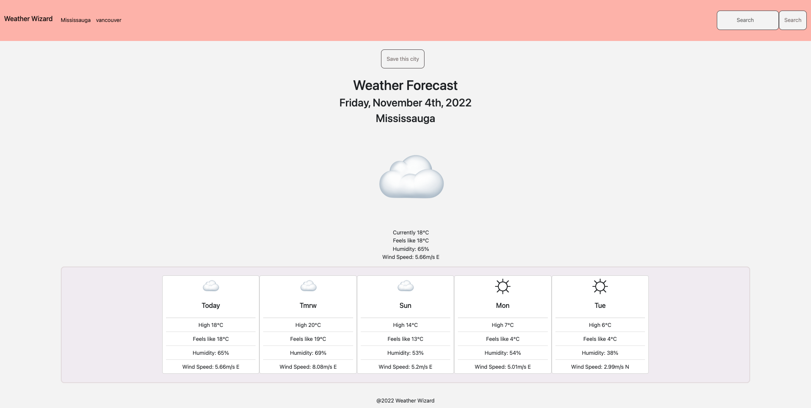

# weather-wizard

## Overview

As technology contiunues to advance, people of all kinds have become increasingly more dependent on their phones and devices to retrieve and view valuable information, such as the weather forecast. Weather Wizard provides users with this in demand data that is accesible to users of all screen dimensions!

## Features

- Resposnsive to all screen dimensions
- Displays weather forecast for user
- User can search a city to view its weather

Link to [Live Website](https://trishaneww.github.io/weather-wizard/)

## Credit

### Trishane Wijeyawickrema
Link to Trishane's [Github Profile](https://github.com/Trishaneww)

## Liscence

N/A
